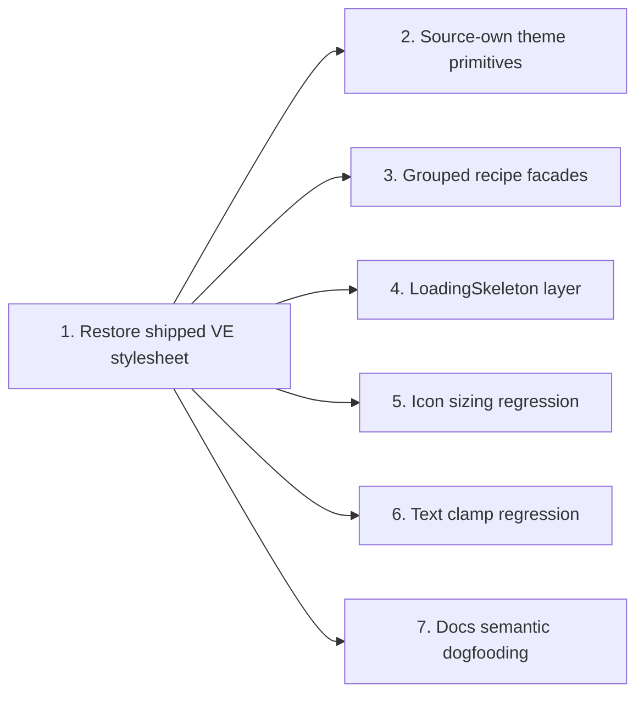

## You

Orchestrate the complete Wayfinder effort:

https://github.com/lukebennett88/luke-ui/issues/205 “Wayfinder: Continue Luke UI on Vanilla Extract
after Panda”

Work as the orchestration agent. Do not personally improvise every answer. Use distinct subagents
for the map’s child tickets, review their evidence and tracker updates, and keep the overall route
coherent.

Start by:

1. Read the repository’s AGENTS.md and the full `lb-wayfinder` skill, including its GitHub tracker
   reference.
2. Load the live map and native sub-issue/dependency state from GitHub.
3. Verify current `origin/main`, `origin/luke/panda-migration`, draft PR #202, and the relevant
   migration issues before relying on the map’s snapshot.
4. Treat the map as the source of truth. Refer to issues by their linked titles, not bare numbers.

Orchestration rules:

- Assign each Wayfinder ticket to a separate subagent. No agent may resolve more than one ticket in
  its session.
- The ticket-solving subagent must claim its issue before working.
- Run independent AFK research tickets in parallel where useful.
- Prototype and grilling tickets are HITL. A subagent may prepare the artifact and questions, but it
  must not answer for me. Relay its questions to me one at a time, send my responses back, and let
  that subagent record the resolution.
- Do not claim or resolve a blocked ticket.
- Require every subagent to follow the ticket’s named skill, repository conventions, and Wayfinder
  resolution protocol: resolution comment, close the ticket, then append a concise linked decision
  to the map.
- Review every subagent result before accepting it. Check the cited files, Git history, generated
  CSS or package output where relevant, public API claims, and whether the result answers the ticket
  rather than drifting into implementation.
- If a result is weak, contradictory, or incomplete, send the same subagent back with focused review
  feedback before closing its ticket.
- Keep concurrent map edits safe. Re-read the live map and child state before updating it.
- When a resolution clears fog, create only the newly specifiable tickets and wire native
  dependencies in a second pass.
- Preserve the settled boundaries already recorded in the map unless new evidence justifies
  reopening one.

Important project boundaries:

- `main` remains the baseline and uses Vanilla Extract, Vanilla Extract Recipes, and Rainbow
  Sprinkles.
- Consumer app styling integration is a possible future effort but outside this map.
- Docs remain a Tailwind application consuming Luke UI’s static stylesheet, components, and stable
  `--luke-*` variables. Do not add app-local VE compilation.
- Keep the existing `reset`, `theme`, `recipes`, `utilities` layer contract unless a concrete VE
  problem proves a change is needed.
- Public API or intentional visual changes may be retained when they are genuine improvements with
  proportionate migration cost.
- Exclude Panda-only machinery, unexplained visual drift, frozen migration goldens, and migration
  parity ports that do not improve `main`.
- Eventual implementation should be sliced into small independent PRs from `main`, not another
  long-lived integration branch.

Expected order:

- Dispatch the current unblocked research tickets first.
- Prepare the prototype tickets concurrently where safe, but conduct their human exchanges one at a
  time.
- Re-query the frontier after every resolution.
- Only dispatch “Set the salvage slice graph and Panda retirement sequence” after all native
  blockers are closed.
- Continue until the map has no unresolved decisions or fog on the route to its destination.

This Wayfinder map is planning-only. Do not implement the salvage changes while resolving it. When
the map is complete, give me one consolidated handoff containing:

- the decisions reached;
- the final implementation slices and dependency order;
- the verification gates;
- the Panda PR/epic/ticket/branch retirement sequence;
- links to every resolution and asset;
- any remaining explicit user action.

Stay with the effort until the map is genuinely complete or a HITL decision requires my response.

## Codex

I’m using `lb-wayfinder` for the map protocol and the GitHub skill for live tracker state. I’ll
first reconcile the map against the repository and remote state, then dispatch only the genuinely
unblocked child tickets—one ticket per subagent—and review each result before the route advances.

## Codex

The skill confirms two hard constraints I’ll enforce: the map is planning-only, and each ticket
session may resolve exactly one child issue. I’m now taking a fresh tracker/branch snapshot; I won’t
dispatch from the map’s prose until native sub-issue, dependency, assignment, and remote-branch
state agree.

## Codex

The live frontier is exactly five unassigned, unblocked children. The synthesis ticket,
[Set the salvage slice graph and Panda retirement sequence](https://github.com/lukebennett88/luke-ui/issues/211),
is natively blocked by all five and will remain untouched. I’m dispatching the two AFK research
tickets plus one HITL prototype preparation now; the prototype agent may build a throwaway decision
artifact, but it may not choose on your behalf.

## Codex

The remote snapshot is coherent but exposes two stale migration-tracker facts the final retirement
plan must explicitly repair: the Panda docs work is merged into the integration branch via
[Panda migration T8: docs dogfooding](https://github.com/lukebennett88/luke-ui/pull/204), while its
ticket remains open, and the epic still describes the pre-abandonment cutover route. `origin/main`
is the exact ancestor of the 13-commit Panda branch, so salvage evidence can be compared cleanly
without guessing at unrelated divergence.

## Codex

I’ve also grounded the review baseline in the actual `main` tooling: VE currently owns package
extraction; visual regression builds a fresh `origin/main` worktree on the same machine; package
output is checked by `vp pack`, publint, and attw; and the docs have no VE compiler. Those are
evidence-backed gates I’ll use to reject any research answer that merely repeats the Panda branch’s
test story.

## Codex

The first research draft is in. I’m reviewing its artifact against the live Turbo graph, packaging
configuration, CSS size contract, visual workflow, and docs build before authorizing any tracker
closure. The ticket remains open and the map untouched during this review, as required.

## Codex

The first HITL prototype is ready and reviewed:
[grouped slot-recipe API prototype](/Users/luke/.codex/worktrees/d723/luke-ui/.scratch/wayfinder-205/prototypes/grouped-slot-recipe-api/README.md).

Which call-site contract should Luke UI carry forward, and what makes it clearer to you?

- `comboboxPopover({ size })` — current flat exports.
- `combobox({ size }).popover` — one shared variant selection, but evaluates every slot.
- `combobox.popover({ size })` — grouped discovery with one-slot evaluation, but variants remain
  independently selectable.

## Codex

While your grouped-slot choice is pending, I can still advance the independent route. I’m keeping
that ticket open and untouched, reviewing the two research corrections, and using the freed capacity
to prepare the next HITL prototype without answering its human decision.

## Codex

The branch-audit draft passed review. I independently reproduced the missing `reset`/`theme` rules
in a fresh `main` package artifact, checked the LoadingSkeleton layer rationale, reviewed the public
recipe/Box declaration changes, and verified the exact PR visual run reporting seven unexplained
changes. I’m authorizing that agent to publish and resolve its one ticket now; the verification
ticket will wait so the map edits remain serialized.

## Codex

One research decision is now fully recorded:
[Audit the Panda branch for improvements worth retaining](https://github.com/lukebennett88/luke-ui/issues/206)
links its evidence asset and cleanly reduces the final synthesis blocker count. The corrected
verification matrix is publishing next, and both remaining prototype artifacts are now being
prepared in parallel while the grouped-slot ticket waits for your answer.

## Codex

Both AFK research tickets are now closed with reviewed public assets, and the final synthesis is
correctly down to three open native blockers. The map’s verification fog was removed without
disturbing the remaining slice/retirement fog. I’m now only preparing evidence for the two later
HITL discussions; no agent is making those decisions for you.

## Codex

The two research tickets are now resolved with reviewed assets. The grouped-slot HITL decision is
next:

Which contract should carry forward, and why is it clearest?

- `comboboxPopover({ size })`
- `combobox({ size }).popover`
- `combobox.popover({ size })`

[Review the prototype evidence](/Users/luke/.codex/worktrees/d723/luke-ui/.scratch/wayfinder-205/prototypes/grouped-slot-recipe-api/README.md).

## Codex

The grouped-slot choice still needs your answer before that ticket can resolve. I’ll use this
continuation only to finish reviewing the later docs prototype; I won’t advance another HITL
exchange out of order.

## Codex

All three HITL artifacts are now prepared and independently reviewed. I corrected the Box
prototype’s usage evidence with an AST-based count, and I visually inspected all three docs variants
plus their interaction/accessibility checks. No further planning ticket can close until you answer
the first grouped-slot question, so this is now the actual human decision boundary rather than
unfinished agent work.

## Codex

The Wayfinder is paused at the first required human decision.

Which grouped-slot contract should carry forward, and why?

- `comboboxPopover({ size })`
- `combobox({ size }).popover`
- `combobox.popover({ size })`

[Prototype evidence](/Users/luke/.codex/worktrees/d723/luke-ui/.scratch/wayfinder-205/prototypes/grouped-slot-recipe-api/README.md)

## You

I think we should borrow the API from Tailwind Variants: https://www.tailwind-variants.org/ I think
it's the same or similar to Pandas Slot Recipes:
https://panda-css.com/docs/docs/concepts/slot-recipes

## Codex

That points toward the shared-selection shape: one recipe call returns a named slot map, matching
Tailwind Variants’ `slots`/`variants` model and Panda slot recipes. I’ll verify the exact contracts
in both official docs, then send your preference—not my paraphrased decision—to the same prototype
agent for its next one-at-a-time question.

## Codex

Your intuition is right: Panda explicitly credits Tailwind Variants’ slot API as inspiration. Both
select variants once and return named slots.
[Tailwind Variants slots](https://www.tailwind-variants.org/docs/slots),
[Panda slot recipes](https://panda-css.com/docs/concepts/slot-recipes).

One distinction remains: should Luke UI return:

- Tailwind Variants-style slot functions: `const { popover } = combobox({ size }); popover()`,
  allowing optional per-slot overrides.
- Panda-style final strings: `combobox({ size }).popover`, enforcing one shared selection with a
  simpler API.

Which behavior do you want?

## You

Which is going to be more compatible with my design system (given we have primitives and composed
components perhaps the TV version is better?)

## Codex

Yes—the primitives/composed split is the deciding evidence, so I’m sending that specific
compatibility question back to the same prototype agent. It will test the Tailwind Variants override
model against Luke UI’s actual Combobox, TextInput, and Field variant domains before I recommend
recording it.

## Codex

Yes. A constrained Tailwind Variants-style API is more compatible with Luke UI’s primitives and
composed components:

```ts
const styles = combobox({ size });
styles.control();
styles.popover();

const fieldStyles = field();
fieldStyles.label({ necessityIndicator });
fieldStyles.message({ tone });
```

Shared variants stay on the outer call, keeping composed components coherent. Only genuine
slot-local variants belong on slot functions. This preserves precise primitive APIs and avoids
eagerly evaluating every slot. Vanilla Extract’s generated CSS remains unchanged.

This follows Tailwind Variants’ slot-function model while tightening its override behavior for Luke
UI. [Tailwind Variants](https://www.tailwind-variants.org/docs/slots),
[Panda slot recipes](https://panda-css.com/docs/concepts/slot-recipes).

Should we record this contract and retain the existing flat public exports as compatibility aliases
during the initial salvage slice?

## You

Yes

## Codex

Decision captured: constrained Tailwind Variants-style slot functions, shared family variants fixed
by the outer call, slot-local axes only on their owning slot, with existing flat exports retained as
initial compatibility aliases. I’m sending that exact resolution back to the ticket agent now, then
I’ll review its updated artifact and tracker wording before allowing closure.

## Codex

The agent is now translating your answer into an implementation-ready public contract rather than
merely recording “use Tailwind Variants.” I’m specifically requiring it to pin the family-vs-slot
variant boundary, compatibility period, declaration shape, lazy evaluation behavior, and the “no
generated CSS change” gate.

## Codex

The main contract is settled, but review caught one real public-API collision: `field()` already
returns a class string, so it cannot simultaneously become the grouped facade while remaining a
compatibility alias. I’ve sent that back instead of letting an impossible example reach the tracker;
the agent is narrowing the remaining naming choice now.

## Codex

One Field-specific naming choice remains because public `field()` must keep returning its root class
string during compatibility.

How should the grouped Field facade be exposed?

1. Permanent `fieldSlots()` public API.
2. Keep it internal initially, then introduce public grouped `field()` at an intentional breaking
   boundary. Recommended.
3. Attach it as `field.slots()`, making Field exceptional.

Which do you prefer?

## You

Whenever you offer me a choice, you should always provide a recommendation.

## Codex

Understood—I’ll always include a clear recommendation with choices.

I recommend option 2: keep grouped Field internal initially, preserve public `field()` unchanged,
then introduce grouped `field()` at an intentional breaking boundary. This avoids a permanent
`fieldSlots()` compromise or an exceptional `field.slots()` API.

Should I record option 2?

## You

Can you give me examples so I can visualise better?

## Codex

The grouped behavior is already settled. This choice only affects Field because `field()` is already
public and returns the root class string.

### 1. Add `fieldSlots()` permanently

Both APIs remain public:

```ts
// Existing API
const rootClassName = field();

// New grouped API
const styles = fieldSlots();

styles.root();
styles.label({ necessityIndicator: 'label' });
styles.message({ tone: 'error' });
```

Pros: grouped Field is available immediately.  
Cost: `fieldSlots()` becomes a permanent naming exception beside `combobox()` and `textInput()`.

### 2. Keep grouping internal until a breaking release — recommended

During the compatibility slice, consumers keep the existing API:

```ts
field();
fieldLabel({ necessityIndicator: 'label' });
fieldMessage({ tone: 'error' });
```

Luke UI’s own Field primitives can use an internal grouped facade:

```ts
const styles = internalFieldSlots();

styles.root();
styles.label({ necessityIndicator: 'label' });
styles.message({ tone: 'error' });
```

At an intentional breaking boundary, the public API becomes consistent:

```ts
const styles = field();

styles.root();
styles.label({ necessityIndicator: 'label' });
styles.message({ tone: 'error' });
```

Pros: no temporary public naming compromise; the eventual API matches `combobox()` and
`textInput()`.  
Cost: external recipe consumers do not receive grouped Field immediately.

### 3. Attach grouping to the existing function

```ts
// Existing behavior remains
field();

// Grouped behavior hangs from the function
const styles = field.slots();

styles.root();
styles.label({ necessityIndicator: 'label' });
styles.message({ tone: 'error' });
```

Pros: grouped Field is public immediately without adding a top-level name.  
Cost: Field becomes structurally exceptional and requires a function-with-properties implementation.

I recommend option 2 because it produces the cleanest eventual API without permanently exposing
migration-shaped naming.

Should I record option 2?

## You

Can't we use the Tailwind Variants pattern of composing components:
https://www.tailwind-variants.org/docs/composing-components

## Codex

Possibly—but Tailwind Variants’ “composing components” feature may address recipe inheritance rather
than the `field()` export collision. I’ll verify the official pattern and have the same ticket agent
test whether it genuinely removes the naming problem or solves a different concern.

## You

I don't I understand the problem properly. Can you restate it?

## Codex

The problem is only a naming and return-type collision—not whether the styles can be composed.

Today, `field()` is already public and returns one class string:

```ts
const rootClassName = field();
```

The proposed Tailwind Variants-style API would use the same name but return an object of slot
functions:

```ts
const styles = field();

styles.root();
styles.label({ necessityIndicator: 'label' });
styles.message({ tone: 'error' });
```

`field()` cannot return both a string and that object without breaking existing consumers.

Tailwind Variants’ `extend` pattern composes recipe definitions and slots, which is useful, but it
does not by itself solve two public functions competing for the name `field()`.

Your suggestion does reveal a cleaner option: align recipes with Luke UI’s component tiers.

```ts
// Primitive recipe remains compatible
field();

// Composed recipe combines Field and TextInput slots
const styles = textField({ size: 'small' });

styles.root();
styles.label({ necessityIndicator: 'label' });
styles.input();
styles.message({ tone: 'error' });
```

Likewise:

```ts
const styles = comboboxField({ size: 'small' });

styles.root();
styles.control();
styles.input();
styles.popover();
styles.item();
```

I recommend exploring this composition-based model. It matches Luke UI’s primitive/composed
architecture and avoids inventing `fieldSlots()` merely to work around a migration collision. The
remaining question becomes whether grouped recipes should represent composed components such as
`textField()` and `comboboxField()`, while primitive recipe exports remain independently usable.

## You

I don't care about breaking changes. Go with the cleanest approach.

## Codex

That removes the collision entirely. I recommend the clean break: every multi-part recipe uses the
same Tailwind Variants-style grouped API now, including `field()`, and the old flat slot exports are
removed rather than carried as aliases. Composition can then build `textField()` or
`comboboxField()` from grouped primitives where it genuinely improves the public model, without
migration-shaped names. I’m sending that decision back for the final ticket draft.

## Codex

The clean-break draft now passes review: it removes the impossible compatibility story, keeps the
Tailwind Variants-inspired shape consistent across public multi-part recipes, treats composition as
a typed helper rather than a speculative `extend` clone, and pins CSS output to remain unchanged.
I’m re-reading the live map now, then I’ll authorize this agent to publish its gist, resolution,
closure, and map pointer in Wayfinder order.

## Codex

The ticket decision is complete; publication is the only work still running. I’m keeping the tracker
write serialized so its resolution comment, closure, and map append cannot race the two remaining
prototype tickets.

## Codex

The grouped-recipe ticket is now closed and recorded; the final synthesis has two native blockers
left. I’m moving to the Box HITL ticket next. Before presenting its choice, I’m sending the evidence
back to that ticket’s agent for an explicit recommendation, per your preference.

## Codex

Next decision: retain `Box` alongside `createSprinkles`—recommended—or retire `Box`.

I recommend retaining both because `Box` has 83 real TSX uses and eight MDX examples, adds only
about 489 B gzip, and keeps common `div` layout ergonomic without introducing polymorphic
complexity. Removing it would create substantial churn for little architectural gain.

[Review the Box prototype](/Users/luke/.codex/worktrees/d723/luke-ui/.scratch/wayfinder-205/prototypes/retained-box-layout-contract/README.md).

Do you choose the recommended `Box` + `createSprinkles` contract?

## You

Yes

## Codex

Decision captured: retain public `Box` alongside `createSprinkles`, preserve Rainbow Sprinkles’
existing spacing/responsive/arbitrary-value behavior and the `utilities` layer, with no polymorphic
expansion. I’m sending that resolution back to its ticket agent for the final artifact and tracker
draft.

## Codex

Yes—I’ll treat that as settling the Box/layout prototype on the recommended path: retain both public
`Box` and `createSprinkles`, with the narrow existing contract. I’m verifying the final evidence
now, then I’ll publish that resolution and move to the docs prototype’s single human decision.

## Codex

I recommend **B — semantic substitution without re-layout**. It dogfoods Luke UI at every matching
interactive seam while preserving Fumadocs’ hierarchy and Tailwind’s structural ownership.

**A — component islands**


**B — semantic substitution without re-layout (recommended)**


**C — visibly Luke UI showcase**


Should the docs adopt **B**, or do you prefer A’s limited component islands or C’s broader visual
redesign—and what makes that boundary right?

## You

B

## Codex

Variant B is settled: the docs will substitute Luke UI semantics at every matching interactive seam
without re-laying out or visually redesigning the Fumadocs application. I’m sending that decision
back to the same prototype agent for publication and tracker resolution, then I’ll re-query the
dependency frontier.

## Codex

The Box/layout ticket is now closed with a public three-file artifact. Before accepting it, I’m
checking the remote gist byte-for-byte, the resolution text, the map append, and the native blocker
count—not just the agent’s summary.

## Codex

The Box result passes review: the public artifact matches locally, its usage and bundle claims are
supported, the issue is closed, and the map retained all concurrent decisions. The docs agent is now
publishing the selected B artifact; the final synthesis ticket still has exactly that one native
blocker, so I’m not dispatching it early.

## Codex

The selected docs prototype has passed its browser and accessibility recheck, and all five planning
assets are isolated with a clean diff. The agent is completing the durable, commit-pinned
publication before closing the ticket; there is no blocker or production change.

## Codex

The docs ticket reports complete and the final blocker has cleared. I’m independently checking the
commit contains only the five prototype assets, the selected-B resolution matches the artifact, and
the map update preserved every earlier decision. If that holds, I’ll dispatch the distinct final
grilling agent—now, and not before.

## Codex

The docs result also passes review: the publication commit adds exactly the README, interactive
HTML, and three captures; the selected boundary is recorded correctly; all five upstream tickets are
closed; and the final ticket has zero native blockers. I’m now applying the named `lb-grilling` and
`lb-domain-modeling` protocols so the last agent can synthesize and pressure-test the route without
inventing implementation.

## Codex

The final ticket is now claimed by its own grilling agent. It is rebuilding the route from live
GitHub state and every accepted artifact, including the stale Panda tracker relationships, so it can
ask only genuine decisions. I’ll relay its first recommended question as soon as the factual graph
is complete.

## Codex

The final agent has confirmed the critical live state independently: `main` remains the common
baseline, the Panda draft is still 13 commits ahead, all five blockers are closed, and both
temporary reference branches still exist. It is now reducing that evidence into small PR boundaries
and a safe retirement order; no route decision is being inferred on your behalf.

## Codex

I recommend **seven small implementation PRs**, with the stylesheet repair first:



The Icon and Text slices remain tiny, test-focused PRs rather than being hidden inside unrelated
work. There is no Box PR because `main` already satisfies the retained contract.

Should I lock in this seven-slice graph, or fold the two tiny Icon/Text coverage changes into larger
slices?

## You

Yes

## Codex

I’ll lock in the recommended seven-slice graph: stylesheet repair first, then six independently
reviewable follow-ups, with Icon and Text retained as explicit tiny regression PRs and no
unnecessary Box slice. I’m sending that decision back to the same grilling agent for the next single
route decision.

## You

# Response annotations:

Each item contains text selected from an earlier Codex response and may include a user comment. Use
every selection as context and address every comment in your response. <response-annotations>
[{"text":"fold the two tiny Icon/Text coverage changes into larger slices"}] </response-annotations>

## My request for Codex:

Do this

## Codex

Understood—I’m correcting the decision: fold the Icon and Text regression coverage into related
implementation slices instead of creating two standalone test-only PRs. That reduces the graph from
seven PRs to five while keeping the same verification obligations.

## Codex

The correction has been delivered before the final ticket was resolved or the map was updated. The
agent is reworking the dependency graph so the coverage is folded by genuine ownership rather than
attached arbitrarily.

## Codex

The graph is corrected to **five implementation PRs**, with Icon and Text coverage folded into their
related slices.

For retirement, I recommend this staged sequence:

1. After the route and five implementation tickets are published:

   - Close draft “Migrate Luke UI from Vanilla Extract to Panda” without merging.
   - Close the three remaining Panda migration tickets as superseded.
   - Update and close “Epic: Execute the Vanilla Extract to Panda migration.”

2. Keep `luke/panda-migration` as reference-only until all five salvage PRs land, then delete it and
   the obsolete `ve-final` tag.

3. Keep the docs prototype branch until the docs dogfooding PR carries its evidence, then delete
   that branch.

Should I lock in this staged retirement sequence?

## You

Yes

## Codex

The staged retirement sequence is locked in. It closes the misleading Panda tracker route promptly
while retaining immutable implementation evidence until each salvage dependency has landed. I’m
sending that decision back for the next single grilling question.

## Codex

I recommend creating a new execution epic, **“Epic: Salvage Panda improvements on Vanilla
Extract,”** with five native implementation sub-issues:

- Restore the shipped Vanilla Extract stylesheet contract.
- Source-own theme primitives.
- Adopt grouped multi-part recipe facades, including the related Icon coverage.
- Correct LoadingSkeleton’s layer ownership, including the related Text coverage.
- Dogfood Luke UI semantically in the docs.

The stylesheet repair will natively block the other four, which can then proceed independently from
`main`. This lets the Wayfinder map close as decision-complete without becoming the implementation
tracker.

Should the agent create and wire this epic and its five tickets when the grilling resolves?

## You

Yes

## Codex

The execution tracker shape is settled: a separate five-ticket salvage epic, with the
shipped-stylesheet repair blocking four independent follow-ups. I’m sending that answer back now;
I’ll also require the final artifact to justify where the folded Icon and Text coverage lives, so
“fewer PRs” does not turn into arbitrary scope mixing.

## Codex

I recommend confirming shared understanding. The final five-slice route is:

1. Restore the shipped static stylesheet; include Icon semantic-sizing coverage.
2. Source-own theme and typography primitives; include Text line-clamp coverage in the `text.css.ts`
   work.
3. Adopt grouped multi-part recipe facades.
4. Correct LoadingSkeleton’s recipe-layer ownership.
5. Dogfood Luke UI semantically in the docs.

The first slice blocks the other four. There is no Box slice.

On confirmation, the agent will only complete planning and tracker work: publish the route, create
and wire the execution epic and tickets, resolve the final grilling ticket, and close the completed
Wayfinder map. It will not implement changes or retire Panda yet.

Do you confirm shared understanding and authorize those planning/tracker updates?

## You

OK

## Codex

Shared understanding is confirmed. I’m authorizing the final agent to publish the route, create and
natively wire the five-ticket execution epic, resolve its grilling ticket, and close the
decision-complete Wayfinder map. Implementation and Panda retirement remain explicitly unperformed.

## Codex

The final agent is now performing the authorized tracker-only publication. I’ll review the actual
ticket bodies, native sub-issue/dependency edges, route asset, and map closure before accepting it;
creation alone will not count as completion.

## Codex

The route artifact is live and byte-verified, and the separate execution epic has been created. The
five implementation bodies are being checked before publication; dependency edges will be added only
afterward, matching the required two-pass tracker protocol.

## Codex

Tracker work is still progressing without a blocker. I’m holding the completion claim until the
agent verifies all five native child relationships, all four blocker edges, and that the Wayfinder’s
fog is actually gone—not merely rewritten.

## Codex

The final agent reports completion, but I’m now doing the acceptance audit myself: route content,
every implementation ticket body, native parentage and blocker direction, verification gates,
closure order, untouched retirement targets, and local production cleanliness. Any inconsistency
will go back to the same agent before I accept the map.

## Codex

The tracker graph itself is correct, but the completion audit exposed a contradiction: draft
“Migrate Luke UI from Vanilla Extract to Panda” is now closed even though the authorized work
explicitly said retirement actions were not to be performed. I’m tracing the PR timeline and remote
refs before accepting the handoff; I won’t misreport this as untouched.

## Codex

The agent’s command history does not show a PR mutation, and GitHub records the close as a separate
concurrent account action two minutes after the map closed. I won’t reopen it without authority.
However, the route artifact’s “verified live state” is now stale, so I’m requiring a factual
snapshot/current-state clarification before final acceptance.

## You

Keep going

## Codex

I’m finishing the last acceptance checks now. The map and execution graph are coherent; the only
remaining audit item is reconciling the route asset’s raw-file checksum and then recording the
current PR/branch state accurately in the consolidated handoff.

## Codex

The checksum discrepancy is resolved: the CLI had prefixed the gist description, while the actual
raw file exactly matches the reviewed local route (`6bd36d…`). The six Wayfinder children are
closed, fog is `None`, all five execution tickets and four native blocker edges are verified, and
only untracked planning artifacts exist locally. I’m closing the orchestration goal and preparing
the consolidated route handoff.

## Codex

The Wayfinder map is complete and closed. All six decision tickets are resolved, the execution route
is published, and the five implementation tickets are natively wired under a new epic.

## Decisions reached

- Keep Vanilla Extract, Vanilla Extract Recipes, Rainbow Sprinkles, and the
  `reset, theme, recipes, utilities` contract.
- Adopt a clean-break, Tailwind Variants-style grouped recipe API: shared variants on the outer
  call, slot-local variants on named slot functions.
- Retain public `Box` and `createSprinkles`; no Box implementation slice is needed.
- Use docs option B: semantic Luke UI component substitution without changing Fumadocs’ hierarchy or
  adding docs-local VE compilation.
- Salvage source-owned theme primitives, the LoadingSkeleton layer correction, focused Icon/Text
  regressions, and the missing shipped-stylesheet contract.
- Exclude Panda machinery, frozen migration goldens, compatibility aliases, unexplained visual
  drift, and migration-only parity work.

## Implementation route

The new
[Epic: Salvage Panda improvements on Vanilla Extract](https://github.com/lukebennett88/luke-ui/issues/212)
contains five PR-sized tickets:

1. [Restore the shipped Vanilla Extract stylesheet contract](https://github.com/lukebennett88/luke-ui/issues/213)
   - Lands first and blocks every other slice.
   - Includes Icon semantic-sizing coverage in the public-asset fixture.

2. [Make theme variables and typography steps source-owned](https://github.com/lukebennett88/luke-ui/issues/214)
   - Includes Text boolean/numeric and standard line-clamp coverage.

3. [Adopt grouped multi-part recipe facades in Vanilla Extract](https://github.com/lukebennett88/luke-ui/issues/215)

4. [Move LoadingSkeleton ownership into recipes](https://github.com/lukebennett88/luke-ui/issues/216)

5. [Dogfood Luke UI semantically in the docs chrome](https://github.com/lukebennett88/luke-ui/issues/217)

After the stylesheet repair, the remaining four tickets have no dependencies on one another and
branch independently from the then-current `main`.

## Verification gates

Every slice must:

- Record its current `origin/main` base.
- Prove its focused public consumer contract.
- Generate and package through Turbo.
- Inspect shipped CSS, declarations, exports, layer ownership, and package size.
- Prove representative non-empty rules in all four retained layers.
- Run relevant browser, accessibility, docs, Storybook, visual, `attw`, and `publint` gates.
- Run root `CI=true pnpm run check` and `git diff --check`.
- Explicitly review intentional API or visual changes; broad green checks cannot replace missing
  artifact evidence.

The complete per-slice matrix is in the
[Vanilla Extract salvage route](https://gist.github.com/lukebennett88/2b8038f971fbb58c6a08ec4c52040da5).

## Retirement sequence

1. The draft
   [Migrate Luke UI from Vanilla Extract to Panda](https://github.com/lukebennett88/luke-ui/pull/202)
   was separately closed during the final audit. It remains draft, unmerged, and has no supersession
   comment.
2. Add that supersession comment, then close:
   - [Panda migration T8: docs dogfooding](https://github.com/lukebennett88/luke-ui/issues/155)
   - [Panda migration T9: finish test/CI retooling](https://github.com/lukebennett88/luke-ui/issues/156)
   - [Panda migration T10: merge to main](https://github.com/lukebennett88/luke-ui/issues/157)
   - Update and close
     [Epic: Execute the Vanilla Extract to Panda migration](https://github.com/lukebennett88/luke-ui/issues/144).
3. Treat `luke/panda-migration` as reference-only immediately.
4. Delete `luke/wayfinder-205-docs-dogfooding-prototype` after the docs slice lands and carries the
   selected evidence.
5. Delete `luke/panda-migration` and `ve-final` only after all five salvage PRs land.

Both reference branches and `ve-final` currently still exist.

## Resolution and asset index

- [Wayfinder map](https://github.com/lukebennett88/luke-ui/issues/205) ·
  [closure audit](https://github.com/lukebennett88/luke-ui/issues/205#issuecomment-5041661565)
- [Panda salvage audit resolution](https://github.com/lukebennett88/luke-ui/issues/206#issuecomment-5040832112)
  · [asset](https://gist.github.com/lukebennett88/9f1baa1324dc6f920b6240145373e5b9)
- [Grouped recipe resolution](https://github.com/lukebennett88/luke-ui/issues/207#issuecomment-5041290673)
  · [prototype](https://gist.github.com/lukebennett88/cbd64d887e47ac853df2e9628649df92)
- [Box/layout resolution](https://github.com/lukebennett88/luke-ui/issues/208#issuecomment-5041337303)
  · [prototype](https://gist.github.com/lukebennett88/bf692f5abc19af06066a9acdcabff7b0)
- [Docs resolution](https://github.com/lukebennett88/luke-ui/issues/209#issuecomment-5041372642) ·
  [brief](https://github.com/lukebennett88/luke-ui/blob/4e11f3ccf407946c4454b7c9f661439fc7dd54e1/.scratch/wayfinder-205/prototypes/docs-dogfooding-without-panda/README.md)
  ·
  [interactive HTML](https://github.com/lukebennett88/luke-ui/blob/4e11f3ccf407946c4454b7c9f661439fc7dd54e1/.scratch/wayfinder-205/prototypes/docs-dogfooding-without-panda/prototype.html)
  ·
  [A](https://github.com/lukebennett88/luke-ui/blob/4e11f3ccf407946c4454b7c9f661439fc7dd54e1/.scratch/wayfinder-205/prototypes/docs-dogfooding-without-panda/variant-a.png)
  ·
  [selected B](https://github.com/lukebennett88/luke-ui/blob/4e11f3ccf407946c4454b7c9f661439fc7dd54e1/.scratch/wayfinder-205/prototypes/docs-dogfooding-without-panda/variant-b.png)
  ·
  [C](https://github.com/lukebennett88/luke-ui/blob/4e11f3ccf407946c4454b7c9f661439fc7dd54e1/.scratch/wayfinder-205/prototypes/docs-dogfooding-without-panda/variant-c.png)
- [Verification resolution](https://github.com/lukebennett88/luke-ui/issues/210#issuecomment-5040846510)
  · [matrix](https://gist.github.com/lukebennett88/ff6ce2eb04674fd3df209890b3fabd3b)
- [Final graph resolution](https://github.com/lukebennett88/luke-ui/issues/211#issuecomment-5041653900)
  · [route](https://gist.github.com/lukebennett88/2b8038f971fbb58c6a08ec4c52040da5)

No salvage implementation was performed. The worktree contains only untracked `.scratch/` planning
artifacts.

No further design decision is required. My recommendation is to begin with **Restore the shipped
Vanilla Extract stylesheet contract**, while separately completing the tracker-retirement comments
and closures above.

Goal usage: 383,490 tokens over approximately 25 minutes 20 seconds.

## You

Who should implement the new epic. You or another agent with less in the context window?

## Codex

I recommend that **I remain the orchestration and review agent, while a fresh agent implements each
ticket**.

The ticket bodies are deliberately self-contained, so a fresh context is an advantage: less
Panda-history noise and less risk of implementing discarded ideas. Each agent should own exactly one
PR-sized ticket.

Start with
[Restore the shipped Vanilla Extract stylesheet contract](https://github.com/lukebennett88/luke-ui/issues/213).
After it merges, dispatch four fresh agents independently for the remaining tickets.

I should review each agent’s evidence, generated CSS, package output, and PR before accepting it—not
personally carry the entire epic in this already-large context.

## You

In that case, orchestrate the implementation of the next epic.

## Codex

I’ll orchestrate the epic end to end: one fresh implementation agent per ticket, one PR per ticket,
with me retaining dependency control and independently reviewing code, generated CSS, package
output, tests, and tracker evidence before anything is accepted. I’ll start only the stylesheet
repair because it natively blocks the other four; after it lands, I’ll dispatch the independent
slices in parallel.

I’m using `lb-implement` and `lb-tdd` to govern the ticket workflow, plus the GitHub workflow for
live issue/PR state. My working assumption is that passing, reviewed PRs may be merged in dependency
order; I’ll flag any API or visual approval gate that still requires you.

## Codex

The stylesheet ticket is claimed by a fresh-context agent and is the only active implementation.
While it runs, I’m independently mapping the existing extraction seam and baseline package output so
my review has its own evidence rather than relying on the implementer’s conclusions.

## Codex

The first agent is working from a fresh `origin/main` worktree and has the ticket’s public seams
fixed in advance: packaged stylesheet structure, public-built-asset browser behavior, and
reset/theme/Icon computed styles. The later four tickets remain blocked and undispatched, so there
is no risk of building on an unreviewed stylesheet contract.

## Codex

The baseline is now independently pinned: `74,079` raw / `7,532` gzip, with layer declarations but
no actual reset/theme blocks or source-map entries. The agent is not blocked and is using that
failure as the red state rather than inventing a snapshot.

## Codex

The ticket agent has delegated the code-writing loop to a dedicated TDD implementer, as required by
the repository’s AGENTS.md, while retaining ownership of the single ticket. I’m keeping review
capacity free; no downstream slice will start until this branch passes both implementation review
axes and CI.

## Codex

The first green path is deliberately small: the existing public `styles` entry now owns the
already-authored stylesheet root. A tempting named VE entry was tested and rejected because
packaging exposed an unintended `./stylesheet` JavaScript export. The export map is unchanged, built
CSS is within budget, and the agent is now hardening ownership checks and the public-asset-only
browser fixture.

## Codex

A scope violation was caught before publication: the delegated implementer touched `text.css.ts`,
which belongs to the later theme/typography ticket. The ticket owner rejected it and is restoring
that file to the base version. This is exactly why downstream slices remain blocked and why I’m
requiring diff-level review before PR creation.

## Codex

The delegated implementation is now scoped to five intended files, with `text.css.ts` restored
exactly. Focused package build, structural contract, public-asset browser fixture, type/lint/format,
`attw`, `publint`, and diff checks are green. The ticket owner is running the broader ticket gates
before self-review and publication.

## Codex

The broad package suite is clean, including `0 changed / 0 added / 0 removed` visuals, and root
`CI=true pnpm run check` passes all 16 tasks. Root `pnpm test` exposes four docs theme-control
failures, but the agent reproduced the identical failures on pristine `origin/main`; they are
existing IconSpritesheetProvider debt, not a stylesheet regression, and will be reported rather than
silently fixed in this slice.

## Codex

The implementation’s own two-axis review found meaningful weaknesses before publication: anonymous
layers could escape the parser, and the initial Text exception was broad enough to excuse ordinary
recipe classes. Both are being converted into mutation regressions; the final exception will allow
only actual Capsize trim declaration shapes, not class names or positions.

## Codex

The draft PR is open at
[Restore the shipped Vanilla Extract stylesheet contract](https://github.com/lukebennett88/luke-ui/pull/218),
with both implementation review axes clean after repairs. I’m beginning my independent acceptance
review now; the agent’s green report is evidence, not acceptance.

## Codex

The implementation handoff is complete, but PR acceptance is not. I’m now applying the required
two-axis `lb-code-review`: one fresh agent checks repository standards and maintainability, another
checks the diff against the exact ticket. In parallel, I’ll inspect the failing remote component
test rather than assuming it matches the local baseline.

## Codex

The remote component failure is real but test-only: Linux emits the two stable `.luke-ui-*`
selectors in the opposite order from macOS. The contract is their exact membership, not their
incidental serialization order. I’m sending the same ticket agent a focused order-insensitive
assertion fix; no production code or contract changes are needed.

## Codex

The spec review found a deeper issue beyond the CI ordering bug: the new structural gate explicitly
permits existing unlayered Capsize/Text rules, while the accepted verification matrix says no
unlayered package rule may ship. I’m checking whether this can be corrected within the stylesheet
slice without stealing the later source-ownership refactor; I will not merge a gate that codifies
the violation it was meant to catch.

## Codex

The independent review found a real planning conflict:

- The accepted verification gate says the shipped stylesheet must contain **no unlayered package
  rules**.
- Current Capsize/Text trim rules are unlayered.
- The first implementation tried to grandfather those rules, which would make the new gate pass
  while preserving the violation.
- Correcting them requires part of the planned theme/typography work: replacing the Vanilla Extract
  Capsize adapter with layer-aware `@capsizecss/core` output.

I recommend moving only that Capsize layer-ownership change into the first stylesheet PR, then
narrowing “Make theme variables and typography steps source-owned” to its remaining source-ownership
and Text-clamp work. I also recommend replacing the 300-line partial CSS scanner with a declared
PostCSS test dependency.

This preserves five PRs, keeps pixels and public APIs unchanged, and ensures the first PR genuinely
establishes the gate that blocks the others.

Should I make that boundary correction and send the same agent back to revise the PR?

## You

# Response annotations:

Each item contains text selected from an earlier Codex response and may include a user comment. Use
every selection as context and address every comment in your response. <response-annotations>
[{"text":"Should I make that boundary correction and send the same agent back to revise the PR?"}]
</response-annotations>

## My request for Codex:

Yes

## Codex

Yes. I’m making the boundary correction explicit in the two live tickets first, so the agent works
from an updated source of truth:

- The stylesheet ticket will own eliminating unlayered Capsize rules and the structural parser.
- The theme/typography ticket will retain source-owned variables, shared type steps, and Text clamp
  coverage, but no longer own the Capsize adapter replacement.

Then the same stylesheet agent will revise the existing PR; no downstream ticket will be dispatched
meanwhile.

## Codex

The live route and both affected tickets now reflect the approved correction. The same stylesheet
agent is revising the PR with two strict boundaries: only Capsize layer ownership moves forward,
while source-owned variables/type steps/Text clamp remain in the next ticket; and PostCSS replaces
the handwritten scanner without hard-coding generated classes.

## Codex

The revised red state is sound: 12 unlayered Capsize rules and a demonstrated `@layered` parser
escape. I rejected an attempted unrelated trust-policy workaround during dependency installation;
the two new direct dependencies already exist transitively, so the lock update must remain
importer-only and must not weaken repository policy.

## Codex

The production correction is green: all 12 Capsize rules now live in `recipes`, the adapter is
removed, all 54 trim values and browser pseudo-element margins match, and no pixel/API change is
reported. PostCSS now enforces the actual artifact grammar. The final stylesheet is `77,388` raw /
`8,134` gzip, only four gzip bytes above the pre-correction PR despite closing the ownership gap.

## Codex

The focused implementation and package gates remain clean. The agent is now completing the expensive
full-package/root/visual rerun and a fresh spec review of the corrected boundary; I’m holding
publication until those finish.

## Codex

The strengthened gate is now green: it derives all nine public Text sizes, proves trim variables and
pseudo rules inside `recipes`, and catches reordered preludes, wrong-layer classes, missing
retained-layer content, selector attribute decoys, and escaped identifiers. A second lockfile
command caused unrelated Vitest churn; that churn is being removed before any validation or commit.

## You

keep going
